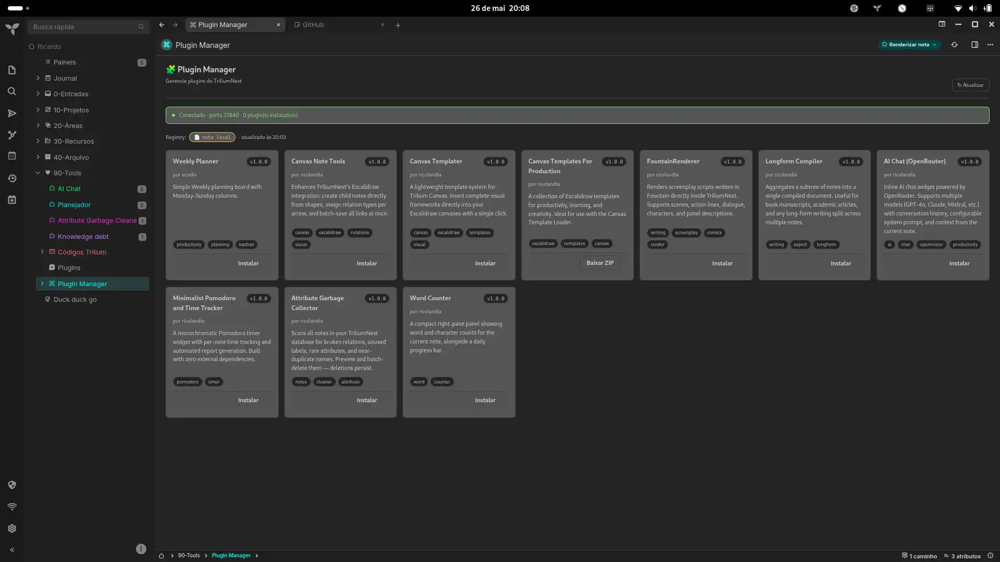

# 🧩 TriliumNext Plugin Manager

A self-contained plugin manager that lives **inside** TriliumNext. Install, update, and remove plugins with a single click — no external tools, no CLI, no wrappers.

```
Render Note → Fetch registry → Show cards → Install / Update / Uninstall
```

---

## How it works

The Plugin Manager is a **JS Frontend Render Note**. On load, it fetches a plugin registry (a JSON file hosted anywhere public), renders a card-based UI, and lets you install, update, or remove plugins.

**Two installation methods:**

| Method | How it works | Token needed? |
|--------|-------------|:---:|
| **`sourceUrl`** (recommended) | Downloads the `.js`/`.jsx` source directly and creates a code note | ❌ No |
| **`zipUrl`** (fallback) | Downloads a ZIP for manual import via Options → Import | ✅ Yes |

For the `sourceUrl` method, no ETAPI token is required — the plugin is created as a code note in one atomic backend call. No HTTP, no ZIP, no deadlock.

---

## Features

- **Install** plugins from a remote or local registry with one click
- **Update detection** — cards turn yellow when a newer version is available
- **Uninstall** — removes the plugin note cleanly
- **Remote registry** with automatic fallback to local note content
- **Source indicator** — shows remote/local source and last fetch time
- **Dual mode** — `sourceUrl` (zero-config) or `zipUrl` (legacy) per plugin entry
- Inherits the active TriliumNext theme via CSS variables

---

## Quick Start

### 1. Create the required notes

```
Plugin Manager         ← Code note, MIME: application/javascript;env=frontend  (paste the JS code)
├── plugin-registry    ← Code note, MIME: application/json  (registry JSON + config labels)
└── Installed          ← Text note  (receives installed plugins as child notes)
```

### 2. Add labels

On **plugin-registry**:

| Label | Value | Required |
|-------|-------|:--------:|
| `#pluginRegistry` | *(no value — marks the note)* | ✅ |
| `#registryUrl` | URL to your `registry.json` | optional |

On **Installed**:

| Label | Value | Required |
|-------|-------|:--------:|
| `#installedPlugins` | *(no value — marks the note)* | ✅ |

> ℹ️ `#etapiToken` and `#triliumPort` are **no longer required** when your registry uses `sourceUrl` entries (recommended). They are only needed if you plan to install legacy `zipUrl`-based plugins.

### 3. Paste the code

1. Create a Code note with MIME `application/javascript;env=frontend`
2. Paste the contents of [`trilium-plugin-manager-v4.js`](./trilium-plugin-manager-v4.js)
3. Add a `~renderNote` relation pointing to the note where you want the panel to appear
4. Open the target note

### 4. (Optional) Set up a remote registry

Create a public [GitHub Gist](https://gist.github.com) with a `registry.json` file. Copy the Raw URL and add it as `#registryUrl` on the plugin-registry note.

---

## Registry format

```json
{
  "plugins": [
    {
      "id": "weekly-planner",
      "name": "Weekly Planner",
      "version": "1.0.0",
      "author": "your-github-username",
      "description": "Weekly planning board with columns.",
      "tags": ["productivity", "planning"],
      "sourceUrl": "https://raw.githubusercontent.com/user/repo/main/planner.jsx",
      "zipUrl": "https://github.com/user/repo/raw/main/planner.zip"
    }
  ]
}
```

| Field | Required | Description |
|-------|:--------:|-------------|
| `id` | ✅ | Unique identifier — used to track installation state |
| `name` | ✅ | Display name shown in the UI |
| `version` | ✅ | Semver string (`1.0.0`) |
| `author` | | Author name |
| `description` | | Short card description |
| `tags` | | Array of tag strings |
| `sourceUrl` | | **Recommended.** Raw URL to the `.js`/`.jsx` source file |
| `zipUrl` | | Legacy URL to a Trilium export ZIP |

At least one of `sourceUrl` or `zipUrl` must be provided. `sourceUrl` is preferred — it works without an ETAPI token.

---

## Architecture

### `sourceUrl` install flow
1. Backend downloads the source file via HTTPS
2. Creates a `code` note with MIME `application/javascript;env=frontend`
3. Sets `#pluginId`, `#pluginVersion`, `#pluginName` labels
4. ✅ Done — no HTTP calls, no ZIP, no SQLite deadlock

### `zipUrl` install flow (legacy)
1. Downloads the ZIP to the user's browser
2. User imports manually via **Options → Import**

### Update detection
On every load, the manager compares the `version` field in the registry against the `#pluginVersion` label on each installed note:
- **Same version** → green card, `✓ v1.0.0`
- **Registry is newer** → yellow card, `↑ v0.5.0 → v1.0.0`
- **Not installed** → default card + **Install** button

---

## Files

| File | Description |
|------|-------------|
| `trilium-plugin-manager-v4.js` | **Main file** — paste into a JS Frontend note |
| `trilium-plugin-manager-v4.html` | Legacy HTML version (kept for reference) |
| `registry.json` | Example registry with official plugins |
| `PLUGIN_DEV_GUIDE.md` | Guide for creating and publishing plugins |

---

## Roadmap

- [ ] Plugin changelog field
- [ ] Startup update badge
- [ ] One-click "Export as plugin" helper note

---

## License

MIT

---

## Screenshots



